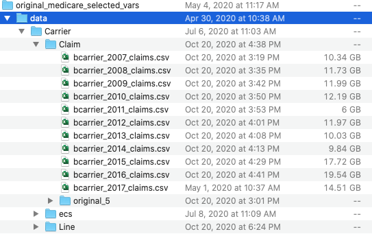

```{r, include = FALSE}
knitr::opts_chunk$set(
  collapse = TRUE,
  comment = "#>"
)
```

## 1. Background

In 2019, we purchased more than 100 procedures that are commonly performed by general surgery surgeons from CMS. The purchased procedures went back from 2007. Since we already have Medicare data from 2007-2016 for the original 5 procedures, we received the purchased procedures in separate datasets. After 2016, all newly added procedures and original 5 procedures are together in one data file each year.

## 2. Datasets

Changes needed for professional claims (Carrier claim and line files). New procedure files location on Maize: `Shared3/DMH_Shared/Dimick_Improve_Surgical_Care/SAS_Files/New_Hernia_ECMD`. We don't need to rerun standardization process for MBSF and MedPAR because we already have 100% MedPAR and MBSF datasets each year. Added beneficiaries and MedPAR cases that are related to Carrier files are already included in the old files.

Note: in the data folder, you can find the datasets from 2007-2017. As mentioned above, after 2016, all procedures will be in one data file under yearly purchased, eg. `Dimick_Improve_Surgical_Care/SAS_Files/2017`.

### Contents

The datasets we use are carrier files named as: `bcarrier_ln_20xx` and `bcarrier_clms_20xx`

-   Combine new carrier files to the original 5 carrier files;

    -   append new data to old data from 2007-2016. After 2016, newly added procedures and the original 5 procedures data files are received as combined one file from CMS. Note: Data purchase was based on BeneIDs. All the benes that already have existing records in our original 5 procedures datasets were excluded from the new procedure data purchase. So there are no duplications in the original carrier claims and the newly purchased procedures.
    -   Newly added procedures claims are saved under file `George_Surgeon_Projects/original\medicare\selectedvars/data/Carrier/ecs` Combine ecs claim and line files with the original 5 procedures by year.

-   Code used to combine datasets are at [add_procedure](https://github.com/UMCSTaR/Medicare_Std_R/tree/add_procedures/code/other/add_new_procedure)

```{r combine,eval=FALSE}
# example
# do not run
purrr::map(c(2007:2016), # year
           ~add_new_procedure(claim = TRUE, 
                              src_data_root = "/Volumes/George_Surgeon_Projects/original_medicare_selected_vars/data/",
                              year = .x))
```

## 3. Process

### Create a defined CPT to procedure names map.

The map we use for the project is at [ecs_list](https://docs.google.com/spreadsheets/d/1Fa2xWCRIe5-_3F7MpQPvJfCzy_lBtWFvB_TGevnZ60Q/edit#gid=1841533335). - In the list, CPTs to ECS procedures are not uniquely mapped. Make sure to get unique maps between cpt to ECS to avoid data processing errors (introduce by left join process)

```{r ecs_list, eval=FALSE}
# do not run
# ecs_list_with_coded_flg.csv was downloaded from https://docs.google.com/spreadsheets/d/1Fa2xWCRIe5-_3F7MpQPvJfCzy_lBtWFvB_TGevnZ60Q/edit#gid=1841533335
cpt_map = readr::read_csv("/Volumes/George_Surgeon_Projects/standardized_medicare_data_using_R/input/raw/ecs_list_with_coded_flg.csv") 
# one cpt to one procedure
cpt_ecs_map = cpt_map %>% 
  distinct(cpt, ecs_id, ECSProcedureName, ProcedureGroup)
```

### Standardization and ceeating analytic files

#### standardization

-   Create 0.1% sample data for the carrier claim and line files

    -   To avoid overwriting the original 5 procedures data, a new folder "original_5" was created to store the old data as below. 

-   Combine ecs files to the old datasets as described above

    -   The ECS folder showing above has all the newly purchased Carrier claim and line files; All the datasets under ECS folder were added to the `Carrier/Claim` folder, so ECS folder should NOT be used after the combining process.

-   Standardize the combined datasets using code std_master

    -   Import_mapping.csv and import_src.csv don't need to be edited, because all the variables and file names didn't change for the new ECS files.

    -   However, the year under import_src.csv needs to be customized to fit in your needs. In our situation, we only need 2007-2016.

```{r year, eval = F}
# you can control years by editing import_src
import_src <- read_csv("data/2020/import_source.csv") %>% 
  filter(source_dir<2017)
```

-   rerun code for step3: Professional and step5: Professional Claim using the combined carrier claim and line files.

#### Creating analytic files

-   Run the [step2\generate\analytic\file](https://github.com/UMCSTaR/Medicare_Std_R/blob/add_procedures/code/step2_generate_analytic_file/analytic_master.R) step.
-   update the procedure map (cpt to procedure map)

```{r update_cpt, eval = F}
# do not run
# procedure map defined by cpt 
define_proc_by_cpt <- readr::read_csv(paste0(wd$input_data, "cpt_ecs_map.csv")) %>% 
  transmute(cpt_cd = as.character(cpt), e_proc_grp = ecs_id, e_proc_grp_lbl = ECSProcedureName) %>% 
  distinct()
```
