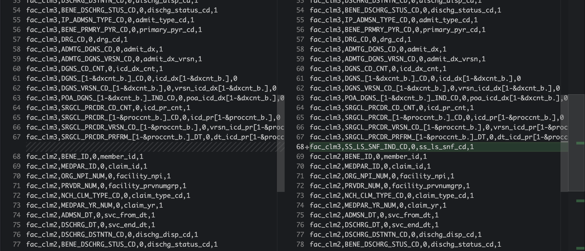

```{r, include = FALSE}
knitr::opts_chunk$set(
  collapse = TRUE,
  comment = "#>"
)
```

If you want to use add variables from the original medicare files to all medicare years, like MedPAR or Carrier, this article would help you to do so.

## Why add more variables? 

You have learned more about medicare and found some useful variables that were not previously used in medicare standardization steps. For example, I recently learned from ResDAC that MedPAR has a variable *SS_LS_SNF_IND_CD* to indicate if it's SNF stay. This is particularly useful since our research is about inpatient procedures. So we would want to exclude SNF claims. I wanted to add this new var to all medicare standardized MedPAR for our analytic files.

## How to add more variables

### Step1: select vars from SAS files

Since all our original files are in SAS format, first step to add this new variable, for example *SS_LS_SNF_IND_CD*,  to our variable selections from SAS

the sas code to do so can be found in
`medicare_std/code/other/sas_code/create_0.1perc_sample_from_sas_data/Medpar.sas`

```
# sas code example
proc export data = medpar.medpar2007 (keep = ORG_NPI_NUM BENE_ID MEDPAR_ID PRVDR_NUM ADMSN_DT DSCHRG_DT DSCHRG_DSTNTN_CD BENE_DSCHRG_STUS_CD IP_ADMSN_TYPE_CD BENE_PRMRY_PYR_CD DRG_CD ADMTG_DGNS_CD DGNS_CD_CNT SRGCL_PRCDR_CD_CNT bene_id DGNS_1_CD DGNS_2_CD DGNS_3_CD DGNS_4_CD DGNS_5_CD DGNS_6_CD DGNS_7_CD DGNS_8_CD DGNS_9_CD DGNS_10_CD SRGCL_PRCDR_1_CD SRGCL_PRCDR_2_CD SRGCL_PRCDR_3_CD SRGCL_PRCDR_4_CD SRGCL_PRCDR_5_CD SRGCL_PRCDR_6_CD SRGCL_PRCDR_PRFRM_1_DT SRGCL_PRCDR_PRFRM_2_DT SRGCL_PRCDR_PRFRM_3_DT SRGCL_PRCDR_PRFRM_4_DT SRGCL_PRCDR_PRFRM_5_DT SRGCL_PRCDR_PRFRM_6_DT SS_LS_SNF_IND_CD)
      dbms=csv
      outfile="Y:\original_medicare_selected_vars\data\MedPAR\medpar2007.csv"
      replace;
run;
```

### Step2: create 0.1% data from the new csv files

code is at `"medicare_std/code/other/sample_raw_data/sample_raw_medicare.R"`

```
# code from the file
# DO NOT RUN

# select medpar records related to the bene in first step
medpar_data_dir <- create_path(
  medicare_dir = medicare_dir,
  data_folder_name = medpar_folder
)

medpar_list <- list(
  demon_sample_data_path = demon_data_dir$sample_data_path,
  read_full_data_path = medpar_data_dir$full_data_path,
  save_sample_data_path = medpar_data_dir$sample_data_path
)

no_cores <- availableCores() - 2
plan(multicore, workers = no_cores)

future_pmap(medpar_list, select_sample, .progress = TRUE)
```

### Step3: change mapping

add the new variable to import_mapping.csv file like below.




### Done!

now, we just need to use the updated data and map for standardization code.

